# OpenHands 接口通路详细流程图

## 1. 控制接口通路详细流程

### 1.1 用户消息处理完整流程

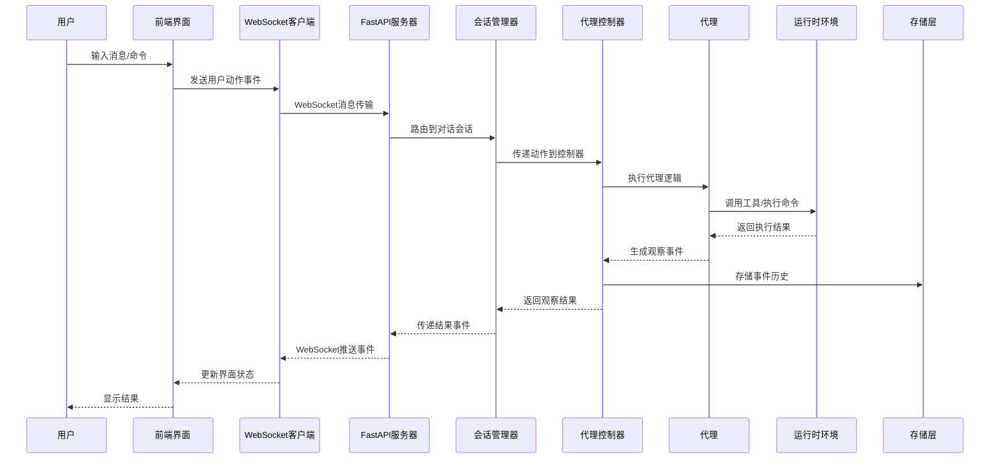

### 1.2 文件操作流程

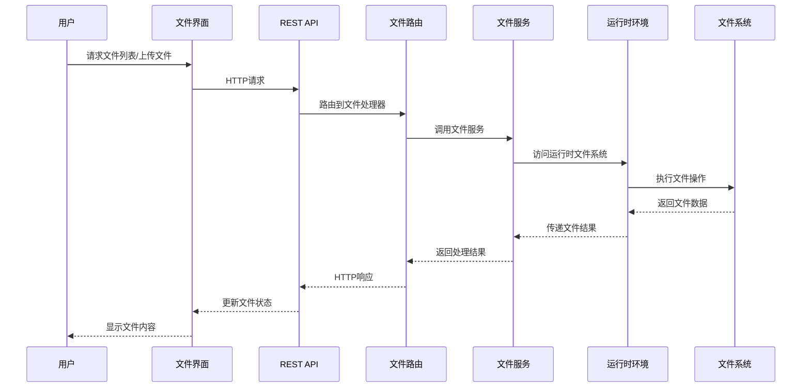

### 1.3 代理状态管理流程

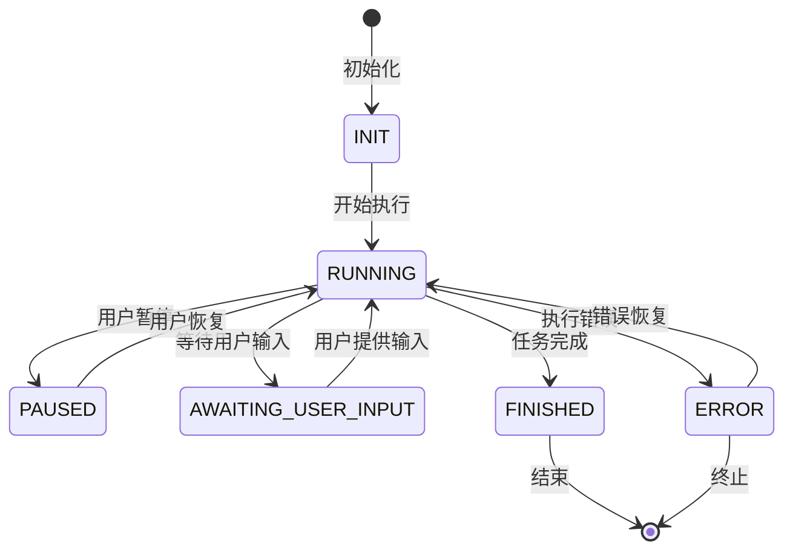

## 2. 配置接口通路详细流程

### 2.1 设置加载流程

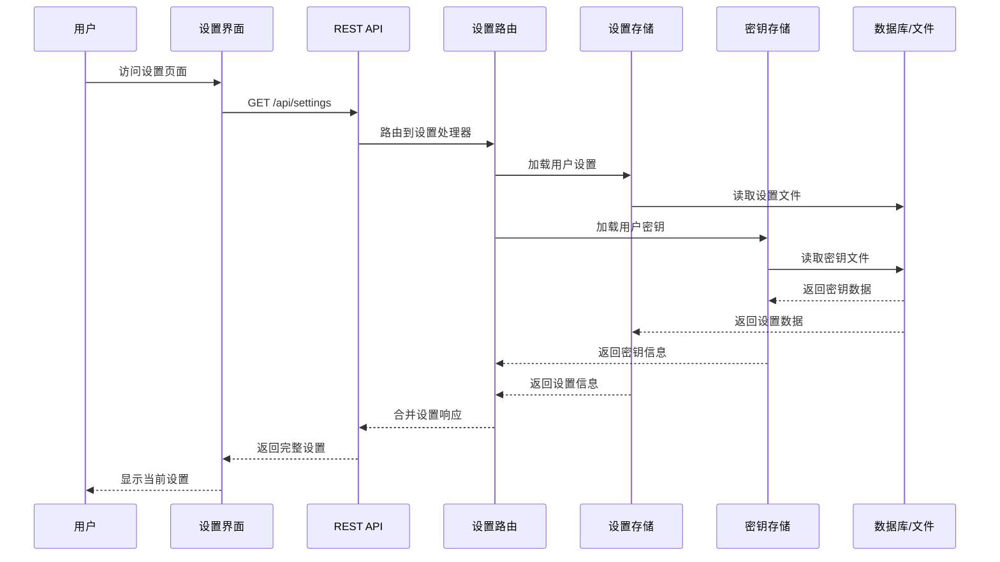

### 2.2 设置保存流程

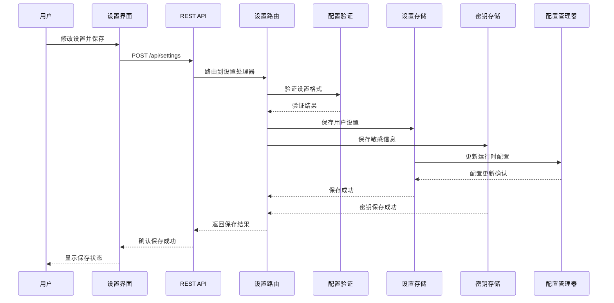

### 2.3 配置层次结构

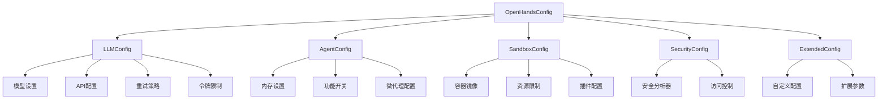

## 3. 核心组件交互图

### 3.1 前端组件架构

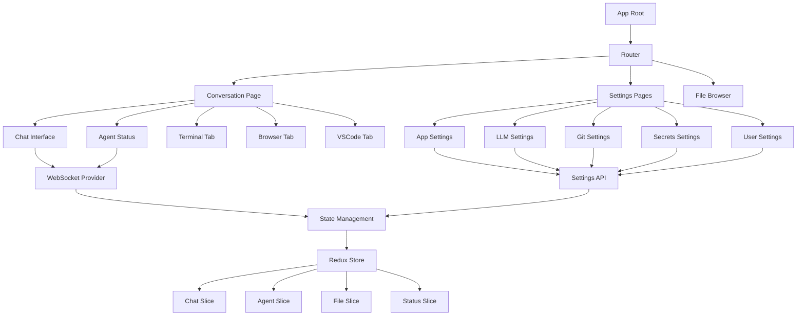

### 3.2 后端服务架构

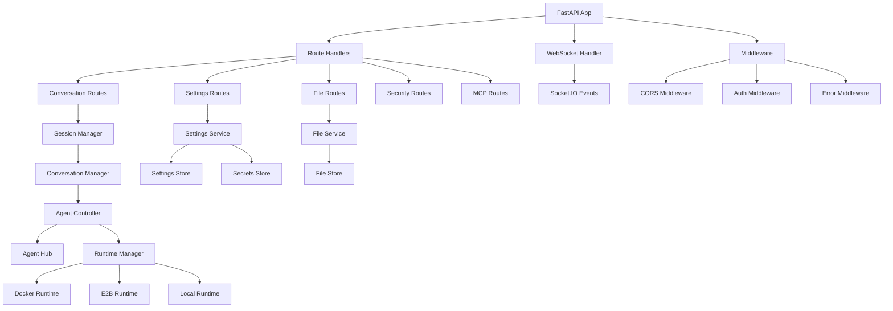

## 4. 数据流向图

### 4.1 用户交互数据流

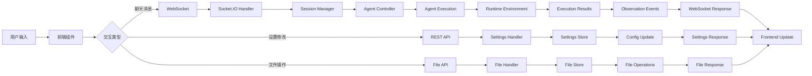

### 4.2 配置传播流程

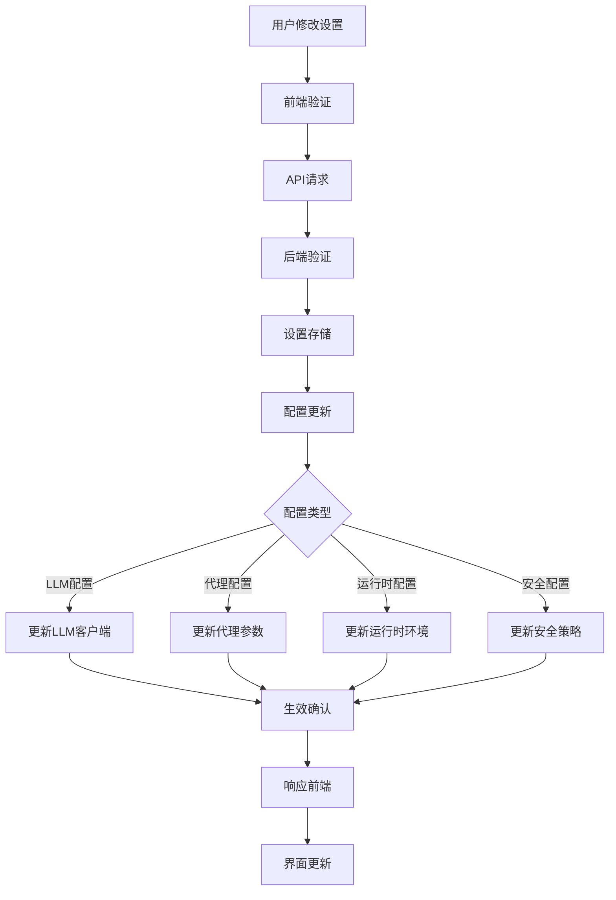

## 5. 错误处理和恢复机制

### 5.1 错误处理流程

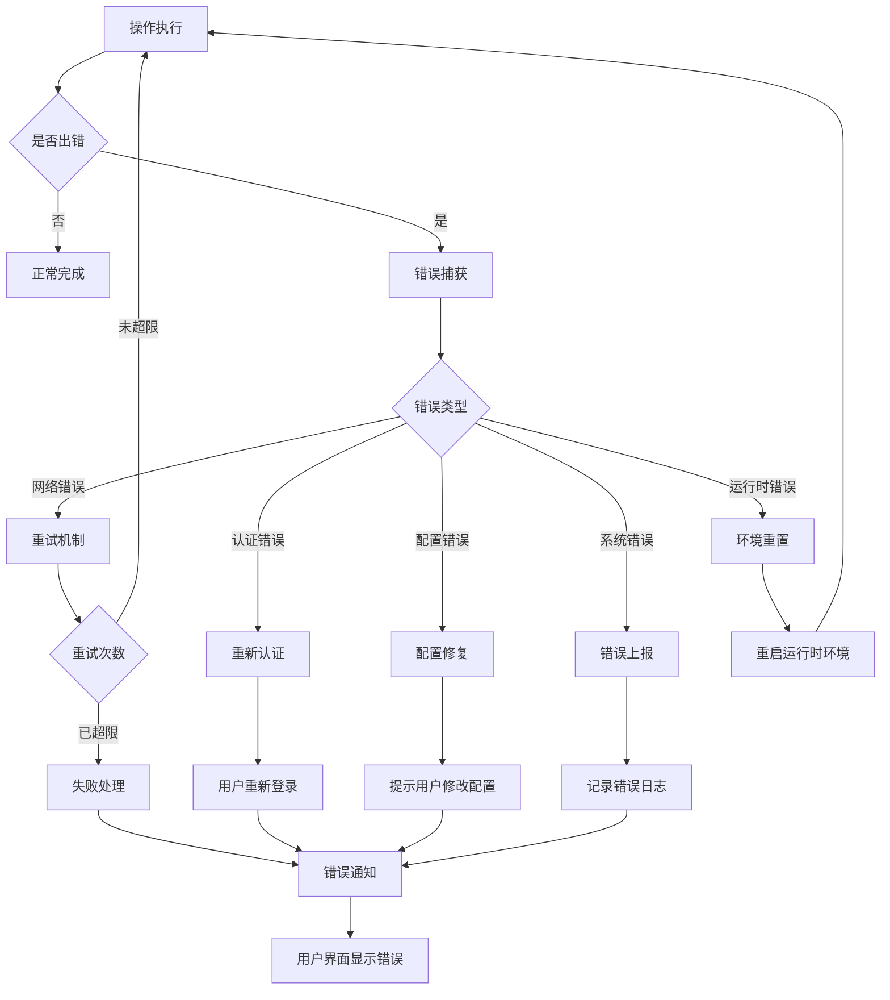

### 5.2 状态恢复机制

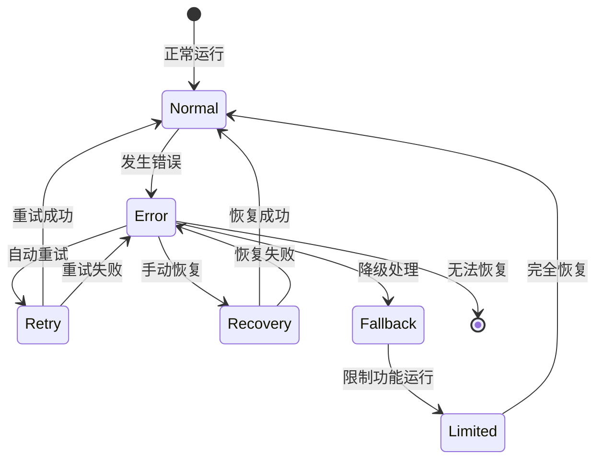

这个详细的接口通路分析展示了 OpenHands 系统中控制接口和配置接口的完整数据流向、组件交互和错误处理机制，为理解和维护系统提供了全面的技术文档。
